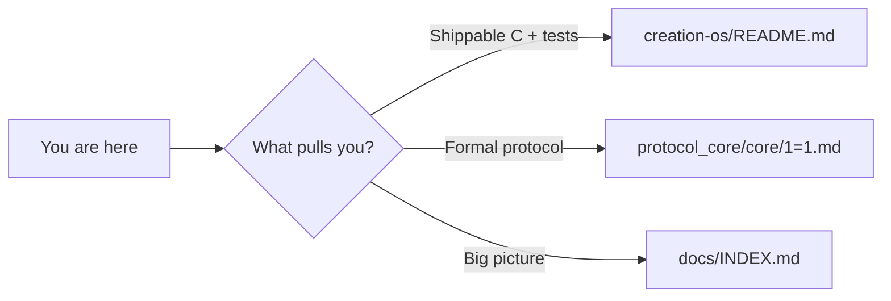

<div align="center">

# SPEKTRE LABS

**1 = 1**

*Industrial dark-luxury minimalism × mathematically-perfect-symmetric mythical Atlantean cybernetics. State before interpretation — invariant first.*

</div>

---

<p align="center">
  
</p>

<p align="center">
  <a href="https://github.com/spektre-labs/spektre-protocol"></a>
  
  
</p>

---

> **Landed from Reddit (or anywhere else)?** Read this once: this monorepo is **not** "yet another ML wrapper." It is **(A)** a formal **state-first protocol** (*Spektre v1.1* — invariants, ownership, commitment) and **(B)** a **portable C kernel** inside [`creation-os/`](creation-os/README.md) where **`1 = 1` is enforced in code**, not vibes. Pick one door below — you can always take the other later.

| I want… | Go here first |
|--------|-----------------|
| **Runnable demos, σ, BSC, `make check-v26`** | [**Creation OS README →**](creation-os/README.md) |
| **The invariant story (`1 = 1`, protocol core)** | [`protocol_core/core/1=1.md`](protocol_core/core/1=1.md) → [`protocol_core/canons/CANON_INDEX.md`](protocol_core/canons/CANON_INDEX.md) |
| **A map of the whole archive** | [`docs/INDEX.md`](docs/INDEX.md) · [`docs/REPO_MAP.md`](docs/REPO_MAP.md) |



---

## Creation OS merge gate

Changes under [`creation-os/`](creation-os/) are validated in CI with **`make merge-gate`**: the portable **`creation_os`** build and tests, plus every flagship **`creation_os_v6.c` … `creation_os_v26.c`** `--self-test` chain (through **204** checks on the current head). From a clone of this monorepo:

```bash
cd creation-os && make merge-gate
```

---

# Spektre repository

Conceptual archive of the **Spektre ecosystem**. Center of gravity: **Spektre v1.1** — a formal state-first protocol (invariants, boundaries, state ownership, commitment, responsibility). The tree is wider: system models, execution logic, human-layer documents, AI / substrate-boundary material, essays, explorations, and preserved archives.

## What Spektre v1.1 is here

The strongest invariant layer:

- **`1 = 1`** as cross-cutting consistency
- **State before interpretation**
- **Explicit ownership before action**
- **Commitment as irreversible transition**
- **Human responsibility as non-delegable**

Primary homes: `protocol_core/` and `formal_structure/`. The rest is **idea-space** around that core — not noise.

## What else lives here

- Formal and architectural framing of state-space and system logic  
- Execution-layer docs (gateways, filters, control, runtime, stabilization)  
- Human-layer texts (regulation, recovery, integration, relationships, trauma, meaning)  
- AI / interface material (AGI framing, LLMs, substrate differences, human–tool boundaries)  
- Applied protocol modules, essays by domain, explorations, archival strata  

## Repository structure (by layer)

| Layer | Path |
|-------|------|
| Canonical core | `protocol_core/` |
| Formalism & architecture | `formal_structure/` |
| Kernel, engine, gateway, diagnostics | `execution_system/` |
| Regulation, recovery, meaning | `human_layer/` |
| Model behavior & boundaries | `ai_interface/` |
| Practical modules | `applied_protocols/` |
| Themed essays | `essays/` |
| Exploratory material | `explorations/` |
| Preserved history | `archive/` |
| Navigation & maps | `docs/` |

## Essay domains

`essays/health_biology/` · `essays/learning_work/` · `essays/economy_access/` · `essays/culture_society/` · `essays/infrastructure_environment/`

## True entry canon (ten documents)

If you only open **ten** files, make them these:

1. `protocol_core/canons/CANON_INDEX.md`  
2. `protocol_core/core/1=1.md`  
3. `protocol_core/core/PROTOCOL.md`  
4. `protocol_core/core/UNITY.md`  
5. `protocol_core/core/SOVEREIGN_AGENCY.md`  
6. `protocol_core/core/STATE_BEFORE_INTERPRETATION.md`  
7. `protocol_core/core/STATE_COMMIT.md`  
8. `formal_structure/system_models/SYSTEM_OVERVIEW.md`  
9. `execution_system/core/SUPERKERNEL.md`  
10. `human_layer/relationships/HUMAN_NETWORK.md`  

They expose the center of gravity: invariant → protocol → structure → execution → human meaning.

## How to read (non-linear)

- **Protocol nucleus:** `protocol_core/canons/CANON_INDEX.md` → `protocol_core/core/` → `formal_structure/`  
- **Systems view:** `formal_structure/system_models/SYSTEM_OVERVIEW.md` → `formal_structure/formalism/` → `execution_system/`  
- **Human layer first:** `human_layer/relationships/HUMAN_NETWORK.md` → `human_layer/regulation/` · `integration/` · `meaning/`  
- **Repo map first:** [`docs/INDEX.md`](docs/INDEX.md) → [`docs/REPO_MAP.md`](docs/REPO_MAP.md) → [`docs/READING_PATH.md`](docs/READING_PATH.md)  

## Creation OS (software kernel)

Portable **C11** reference: binary spatter codes, `make check`, measured cost-shape where documented. **Entry:** [creation-os/README.md](creation-os/README.md) · [COMMON_MISREADINGS](creation-os/docs/COMMON_MISREADINGS.md) · [CLAIM_DISCIPLINE](creation-os/docs/CLAIM_DISCIPLINE.md).

## Orientation notes

- Earlier protocol-centered root README: `protocol_core/reference/README_SPEKTRE_V1_1.md`  
- Canonical and exploratory documents are **both** retained on purpose  
- Structure goal: **layers visible** without collapsing the idea-space  

---

<p align="center">
  <b>Spektre Labs</b> · invariant first · <a href="creation-os/README.md">Creation OS</a> inside
</p>

---

<div align="center">

Part of Spektre Labs · spektrelabs.org · 1=1

</div>
